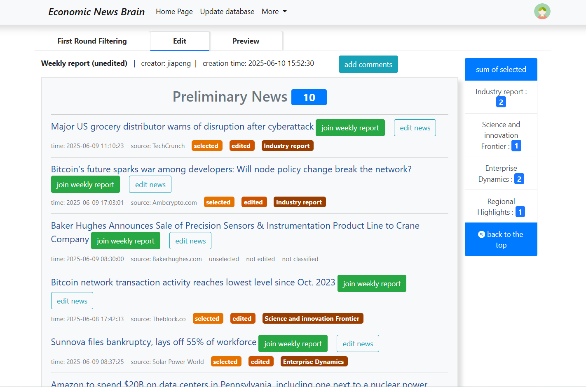
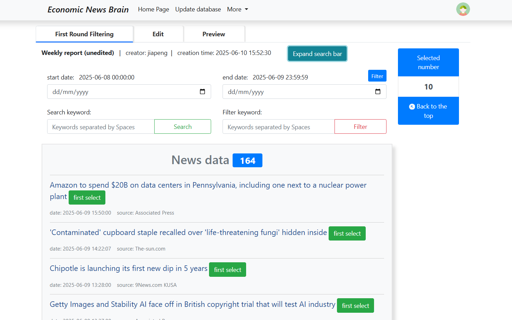
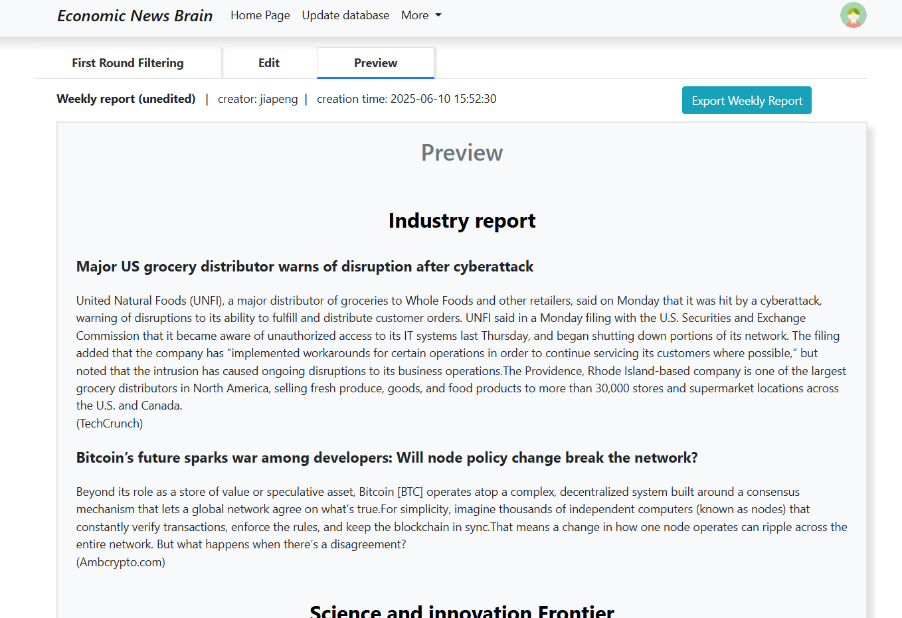
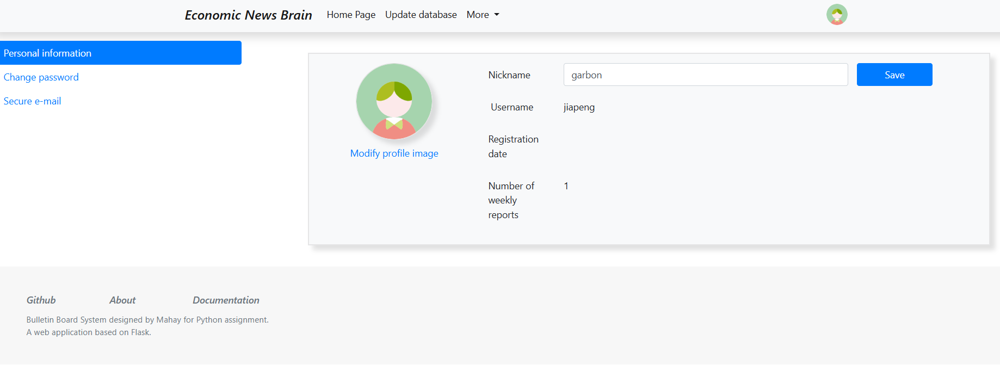

<div align="center">

  <a>
    
  </a>

  <h1 align="center">News Brain</h1>

  <p>
    News search and edit platform based on Flask
  </p>

  <div align="center">
    
  </div>

</div>

## Features
This system is designed to automate the collection, filtering, summarization, and reporting of real-time financial and economic news. It integrates multiple components to streamline the workflow from data acquisition to report generation.

- Real-time financial and economic news collection from the News API and web scraping via Scrapy

- News search, filtering, and ranking system to identify the most relevant articles for inclusion in reports

<div align="center">
  
</div>

- News editing module with automatic summarization using the BART model

- Report preview and download functionality
<div align="center">
  
</div>

- User management system for account control and access permissions
<div align="center">
  
</div>

## Build With
[![Python][Python]][Python-url]
[![Flask][Flask]][Flask-url]
[![SQL][SQL]][SQL-url]
[![MySQL][MySQL]][MySQL-url]
[![JavaScript][JavaScript]][JavaScript-url]
[![HTML][HTML]][HTML-url]
[![CSS][CSS]][CSS-url]
[![Docker][Docker]][Docker-url]

## Build the project

### Deploy Locally

Create an `.env` file and add the following variables like this.

```
// SAMPLE CONFIG .env, you should put the actual config details found on your project settings

NEWS_API_KEY=your_news_api_key_here

MYSQL_HOST=127.0.0.1
MYSQL_PORT=3306
MYSQL_USER=root
MYSQL_PASSWORD=your_mysql_password_here
MYSQL_DATABASE=idea_bank

MONGO_HOST=127.0.0.1
MONGO_PORT=27017
MONGO_USER=admin
MONGO_PASSWORD=123456
MONGO_DATABASE=news_db

AWS_ACCESS_KEY=your_aws_access_key_here
AWS_SECRET_KEY=your_aws_secret_key_here
S3_BUCKET_NAME=your_s3_bucket_name_here

REDIS_URL=redis://localhost:6379/0

``` 

After setting up necessary configuration, start `mysql`, `mongodb` and `redis` sequentially locally. Then, install the required packages using pip:

```bash
pip install -r requirements.txt
```

Then, run the application:

```bash
python app.py
```

### Deploy by Docker

1. Create Dockerfile in flask like this:
    
    ```bash
    # Use an official Python runtime as a parent image (Linux)
    FROM python:3.11
    
    # Set the working directory in the container
    WORKDIR /app
    
    # Copy the current directory contents into the container at /app
    COPY . /app
    
    # Install any needed packages specified in requirements.txt
    RUN pip install --no-cache-dir -r requirements.txt
    
    # Make port 5000 available to the world outside this container
    EXPOSE 5000
    
    # Define environment variable
    ENV NAME World
    
    # When the Docker container starts, CMD ["python", "run.py"] is executed as the default command.
    # Run app.py when the container launches (use gunicorn as the server)
    # CMD ["gunicorn", "-w", "4", "-b", "0.0.0.0:5000", "app:app"]
    CMD ["python", "app.py"]
    ```
    
2. Run `docker build -t flask .` to run Dockerfile at current path: `.` and build a docker image called flask-app. Use `docker images` to check it
3. Build mysql image, container
    
    ```bash
    docker pull mysql:8.0
    
    # use -v to add setup.sql, it will run automatically and store at /var/lib/mysql
    # use -v to store mysql data to volume of docker
    docker run -d
      --name mysql80
      -e MYSQL_ROOT_PASSWORD=110110
      -v "D:/Personal_Experience/news_brain/mysql_init/setup.sql:/docker-entrypoint-initdb.d/setup.sql" 
      -v mysql_data:/var/lib/mysql
      mysql:8.0
    
    ```
    
4. Build redis image, container
    
    ```jsx
    docker pull redis:latest
    
    docker run -d
      --name redis-server
      redis:latest
      redis-server --appendonly yes
    ```
    
5. Build a network and add mysql, redis in it
    
    ```bash
    docker network create web_app
    docker network ls
    
    docker network disconnect bridge mysql
    docker network disconnect bridge redis-server
    
    docker network connect web_app mysql
    docker network connect web_app redis-server
    ```
    
6. Run the image: `docker run -p 5000:5000 flask-app`
    
    ```bash
    # the host name should use DNSNam
    docker run -d
      --name flask
      --network web_app
      -p 5000:5000
      -e MYSQL_HOST=mysql80
      -e REDIS_URL=redis://redis-server:6379/0
      flask
    ```
    
7. Build nginx image, container
    
    ```bash
    docker pull nginx:latest
    
    docker run -d
      --name nginx-server
      -p 80:80
      --network web_app
      -v "D:/Personal_Experience/news_brain/nginx/default.conf:/etc/nginx/conf.d/default.conf"
      nginx:latest
    ```
    
8. Add web server to flask, change from `CMD ["python", "[app.py](http://app.py/)"]` to `CMD ["gunicorn", "-w", "4", "-b", "0.0.0.0:5000", "app:app"]` . Remember to define app outside the main and use:
    
    ```bash
    with app.app_context():
        init_db(app)
    ```
    
    Since gunicorn will use many workers and it find app in [app.py](http://app.py) to run
    
9. Build flask, mysql, nginx, redis together:
    
    Create docker-compose.yml like this:
    
    ```bash
    services:
      flask:
        build: . # Build the image from the Dockerfile in the current directory
        container_name: flask_app
        expose:
          - "5000"
        depends_on:
          - mysql
          - redis
        environment:
          MYSQL_HOST: mysql # prior than .env
          MYSQL_ROOT_PASSWORD: 110110
          REDIS_URL: redis://redis:6379/0
        restart: always
        volumes:
          - .:/app
    
      mysql:
        image: mysql:8.0
        container_name: mysql80
        expose:
          - "3306"
        restart: always
        environment:
          MYSQL_ROOT_PASSWORD: 110110
          MYSQL_DATABASE: idea_bank
        volumes: 
          - mysql_data:/var/lib/mysql
          - ./mysql_init:/docker-entrypoint-initdb.d
    
      redis:
        image: redis:latest
        container_name: redis_server
        restart: always
        expose:
          - "6379"
    
      nginx:
        image: nginx:latest
        container_name: nginx_server
        ports:
          - "80:80"
        volumes:
          - ./nginx/default.conf:/etc/nginx/conf.d/default.conf
        depends_on:
          - flask
        restart: always
    
    volumes:
      mysql_data:
    ```
    
    1. Docker-compose.yml will add all containers into one network, use DNSName of the container as the host name and do not expose any port to the host port. It can avoid port conflict and reaching container through ports from the host machine. 
    2. Volumes can execute script automatically at the first time, and volumes store the data from the containers. Remember if volume already exists, the script would not run.


<!-- Badge Links -->

[Python]: https://img.shields.io/badge/Python-3776AB?style=for-the-badge&logo=python&logoColor=white
[Python-url]: https://www.python.org/

[Flask]: https://img.shields.io/badge/Flask-000000?style=for-the-badge&logo=flask&logoColor=white
[Flask-url]: https://flask.palletsprojects.com/

[SQL]: https://img.shields.io/badge/SQL-4479A1?style=for-the-badge&logo=postgresql&logoColor=white
[SQL-url]: https://en.wikipedia.org/wiki/SQL

[MySQL]: https://img.shields.io/badge/MySQL-005C84?style=for-the-badge&logo=mysql&logoColor=white
[MySQL-url]: https://www.mysql.com/

[JavaScript]: https://img.shields.io/badge/JavaScript-F7DF1E?style=for-the-badge&logo=javascript&logoColor=black
[JavaScript-url]: https://www.javascript.com/

[HTML]: https://img.shields.io/badge/HTML5-E34F26?style=for-the-badge&logo=html5&logoColor=white
[HTML-url]: https://html.com/

[CSS]: https://img.shields.io/badge/CSS3-1572B6?style=for-the-badge&logo=css3&logoColor=white
[CSS-url]: https://developer.mozilla.org/en-US/docs/Web/CSS

[Docker]: https://img.shields.io/badge/Docker-2496ED?style=for-the-badge&logo=docker&logoColor=white
[Docker-url]: https://www.docker.com/

